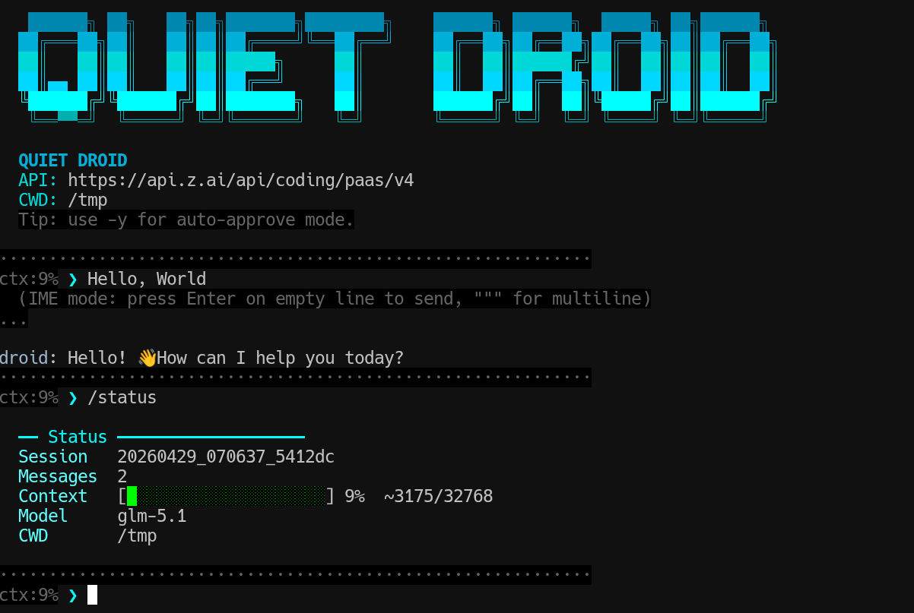

<h1 align="center">Quiet Droid</h1>

<p align="center">
  <strong>OpenAI互換API向けの最小ターミナルコーディングエージェント</strong>
</p>

<p align="center">
  <a href="README_JP.md"></a>
  <a href="README.md"></a>
</p>

<p align="center">
  
  
  
  
</p>

<p align="center">
  静かに動いて、必要なときだけ強く出るターミナル向けコーディングエージェント
</p>

<p align="center">
  
</p>

## ✨ Features

- OpenAI互換APIの `/v1/chat/completions` を利用
  - ただし `model` が `glm-` で始まる場合は `/chat/completions` を利用
- 基本ツールのみ搭載
  - `Bash`
  - `Read`
  - `Write`
  - `Edit`
  - `Glob`
  - `Grep`
  - `AskUserQuestion`
- エージェント補助ツール
  - `SubAgent`
  - `ParallelAgents`
- Skills の自動読込
- Hooks
- `AGENTS.md` / `CLAUDE.md` / `.quiet-droid.json` によるプロジェクト指示の自動読込
- 対話モードと one-shot モード
- セッション保存、履歴保存、権限確認の管理
- プロジェクト単位またはセッションID指定での会話再開

## 🚀 Quick Start

`qd` コマンドで使う場合:

```bash
pipx install .
export OPENAI_BASE_URL="http://localhost:8000/v1"
export OPENAI_API_KEY="your-api-key"
qd
```

スクリプトを直接実行する場合:

```bash
export OPENAI_BASE_URL="http://localhost:8000/v1"
export OPENAI_API_KEY="your-api-key"
python3 quiet-droid.py
```

one-shot 実行:

```bash
python3 quiet-droid.py -p "pwd を実行して"
```

Debian / Ubuntu 系では PEP 668 により `pip install -e .` が失敗することがあります。その場合は `pipx install .` か、仮想環境を作って `pip install -e .` を使ってください。

## 📦 Installation

`pipx` を使う場合:

```bash
pipx install .
```

更新する場合:

```bash
pipx reinstall .
```

アンインストールする場合:

```bash
pipx uninstall quiet-droid
```

仮想環境を使う場合:

```bash
python3 -m venv .venv
. .venv/bin/activate
pip install -e .
```

仮想環境版を削除する場合:

```bash
deactivate  # 有効化している場合のみ
rm -rf .venv
```

インストール後は次のコマンドが使えます。

```bash
qd --help
quiet-droid --help
```

## 📋 Requirements

- Python 3.10+
- OpenAI互換APIサーバ
  - `/v1/chat/completions`

## ⚙️ Configuration

設定方法は3通りあります。

1. 環境変数
2. CLI引数
3. `~/.config/quiet-droid/config`

優先順位は `CLI引数 > configファイル > 環境変数 > デフォルト値` です。

初回起動時には設定ディレクトリと状態保存ディレクトリを自動作成します。
モデルは自動選択しません。`--model`、`MODEL`、`QUIET_DROID_MODEL`、`OPENAI_MODEL` のいずれかで明示してください。

Linux / macOS:

- 設定ディレクトリ: `~/.config/quiet-droid`
- 権限設定: `~/.config/quiet-droid/permissions.json`
- 状態保存ディレクトリ: `~/.local/state/quiet-droid`
- セッション保存先: `~/.local/state/quiet-droid/sessions`
- 入力履歴: `~/.local/state/quiet-droid/history`

Windows:

- 設定ディレクトリ: `%LOCALAPPDATA%\quiet-droid`
- 設定ファイル: `%LOCALAPPDATA%\quiet-droid\config`
- 権限設定: `%LOCALAPPDATA%\quiet-droid\permissions.json`
- 状態保存ディレクトリ: `%LOCALAPPDATA%\quiet-droid`
- セッション保存先: `%LOCALAPPDATA%\quiet-droid\sessions`
- 入力履歴: `%LOCALAPPDATA%\quiet-droid\history`

`config` ファイル本体は自動生成しません。必要な場合だけ `~/.config/quiet-droid/config` を手動で作成してください。

グローバル指示ファイルは `~/.config/quiet-droid/CLAUDE.md` を優先して読み込みます。`CLAUDE.md` が無い場合は `~/.config/quiet-droid/AGENTS.md` を読み込みます。

### Environment Variables

```bash
export OPENAI_BASE_URL="http://localhost:8000/v1"
export OPENAI_API_KEY="your-api-key"
export QUIET_DROID_MODEL="gpt-4.1-mini"
export OPENAI_MODEL="gpt-4.1-mini"
export QUIET_DROID_DEBUG="1"
```

モデル指定は `QUIET_DROID_MODEL` を優先し、互換目的で `OPENAI_MODEL` も利用できます。

互換目的で `OLLAMA_HOST` も `OPENAI_BASE_URL` の代替として利用できます。

`z.ai` の `glm-*` モデルを使う場合は、`OPENAI_BASE_URL` に `/v1` ではなく API ルートを指定してください。

```bash
export OPENAI_BASE_URL="https://api.z.ai/api/paas/v4"
export QUIET_DROID_MODEL="glm-4.5"
```

### Config File

`~/.config/quiet-droid/config`

```ini
OPENAI_BASE_URL=http://localhost:8000/v1
OPENAI_API_KEY=your-api-key
MODEL=gpt-4.1-mini
OPENAI_MODEL=gpt-4.1-mini
MAX_TOKENS=8192
TEMPERATURE=0.7
CONTEXT_WINDOW=32768
```

config ファイルでは `MODEL` を優先し、互換目的で `OPENAI_MODEL` も利用できます。

### CLI

```bash
python3 quiet-droid.py --base-url http://localhost:8000/v1 --api-key your-api-key --model gpt-4.1-mini
```

主な追加オプション:

```bash
python3 quiet-droid.py \
  --max-tokens 8192 \
  --temperature 0.7 \
  --context-window 32768 \
  --debug \
  --yes
```

保存済みの会話を再開:

```bash
qd --resume
qd --session-id 20260429_123456_ab12cd
qd --list-sessions
```

### Session Resume

Quiet Droid は会話をセッション保存先の JSONL ファイルとして保存します。

- `qd --resume` は現在の作業ディレクトリに紐づく保存済みセッションを再開します。
- プロジェクトに紐づくセッションがない場合、`qd --resume` は直近の保存済みセッションを再開します。
- `qd --session-id <id>` は指定したセッションを再開します。
- `qd --list-sessions` はモデル未設定でも保存済みセッションを一覧表示します。

再開されるのは会話メッセージとツール結果です。作業ツリー内のファイル変更を巻き戻したり復元したりはしません。

## 💻 Usage

対話モード:

```bash
qd
```

one-shot:

```bash
qd -p "pwd を実行して"
```

ヘルプ:

```bash
qd --help
```

## ⌨️ Interactive Commands

- `/help`
- `/exit`
- `/clear`
- `/status`
- `/save`
- `/compact`
- `/model`
- `/models`
- `/yes`
- `/no`
- `/debug`

通常入力では `exit` / `quit` / `bye` でも終了できます。
`Tab` で `/` コマンド補完ができます。`/` だけを入力して Enter するとコマンド一覧を表示します。
`Tab` で `$skill` 補完ができます。`$` だけを入力して Enter すると、ロード済み Skill 一覧を表示します。

## 🧩 Skills

以下のディレクトリにある `*.md` を自動で読み込みます。

- `~/.config/quiet-droid/skills/`
- `.quiet-droid/skills/`
- `./skills/`

Skills はシステムプロンプトへ注入されます。
対話中に `$plan` のように Skill 名を入力しやすいよう、ロード済み Skill 名は Tab 補完と一覧表示に使われます。

## 📜 Project Instructions

プロジェクト固有の指示ファイルとして、カレントディレクトリから親ディレクトリ方向へ以下を探索して自動読込します。

- `.quiet-droid.json`
- `CLAUDE.md`
- `AGENTS.md`

見つかったファイル内容はシステムプロンプトへ順に注入されます。`AGENTS.md` に運用ルールや出力言語、作業方針を書いておく運用に対応しています。
同一階層に複数あっても、各ディレクトリでは最初に見つかった1ファイルのみを採用します。
グローバル設定ディレクトリでは `CLAUDE.md` を優先し、無ければ `AGENTS.md` を採用します。

## 🪝 Hooks

最小実装として `command` 型フックをサポートしています。設定ファイルは次の順で読み込みます。

- `~/.config/quiet-droid/hooks.json`
- `./.quiet-droid/hooks.json`

対応イベント、フックタイプ、設定例は [docs/hooks_JP.md](docs/hooks_JP.md) を参照してください。

Claude Code の公式ドキュメント:

- https://code.claude.com/docs/ja/hooks

## 📝 Config Example

最小構成の例:

```ini
OPENAI_BASE_URL=http://localhost:8000/v1
OPENAI_API_KEY=your-api-key
MODEL=gpt-4.1-mini
```

## 📎 Notes

- `OPENAI_BASE_URL` は `/v1` 付きでも無しでも動くようにしています。
- `OPENAI_API_KEY` が必要なサーバでは設定してください。
- モデル未指定の場合は起動時にエラーになります。
- `--yes` と `--dangerously-skip-permissions` は同じ意味で、ツール確認を自動承認します。
- 互換目的で `OLLAMA_HOST` と `--ollama-host` も受けますが、内部的には `base_url` として扱います。

## 💐 Acknowledgments

[vibe-local](https://github.com/ochyai/vibe-local)を公開して下さった筑波大学の落合教授に感謝いたします。

## 📄 License

MIT
